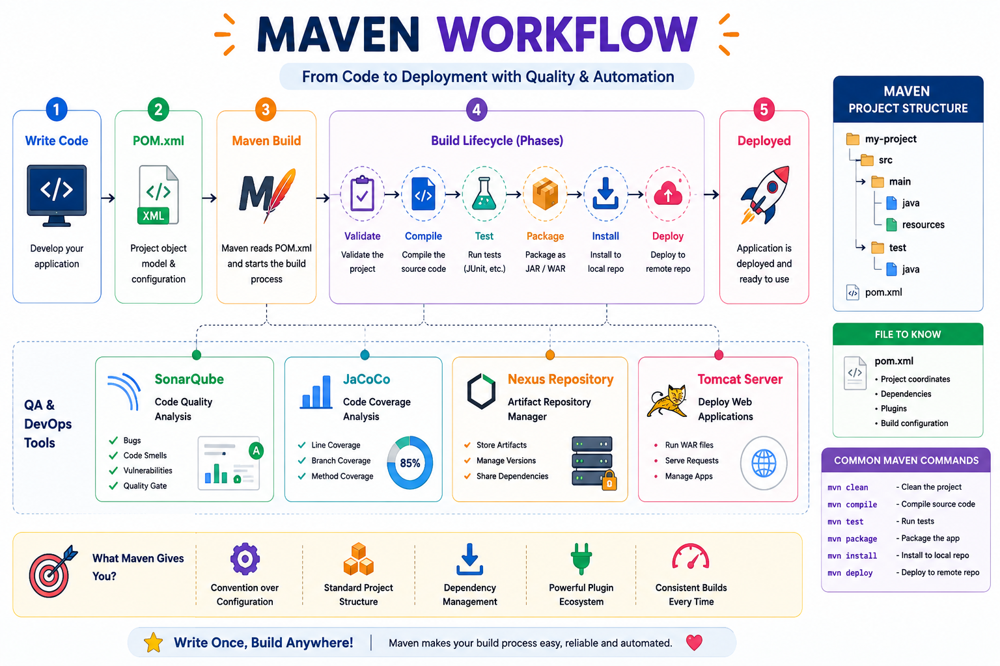

# 🚀 Maven Notes

> My step-by-step notes while learning Apache Maven and its role in the DevOps workflow — sharing them here in case they help someone else too. Suggestions and corrections are always welcome! 🙌

---

## 👋 Why this repo exists

I started learning Maven as part of understanding the **DevOps build and deployment workflow**, and instead of letting my notes stay in a random notebook, I decided to turn them into this repository.

It's part **learning log**, part **quick reference**, and something I can come back to whenever I need to revise Maven.

If you're learning Maven too, feel free to fork this, star it, or suggest improvements.😊

---

## 📚 What You'll Find Here

Click on any topic to jump straight to it:

| # | Topic | What it covers |
|---|---|---|
| 1 | 🔨 [Maven Fundamentals](01-maven-fundamentals.md) | Why we need build tools in the first place,What Maven is, POM, dependencies, plugins, Lifecycles, phases and Maven commands |
| 2 | 🔍 [SonarQube](Sonarqube.md) | Code quality analysis |
| 3 | ⚙️ [Tomcat Deployment](Tomcat.md) | Deploying the built artifact |

---

## 🧭 Maven Workflow

  

